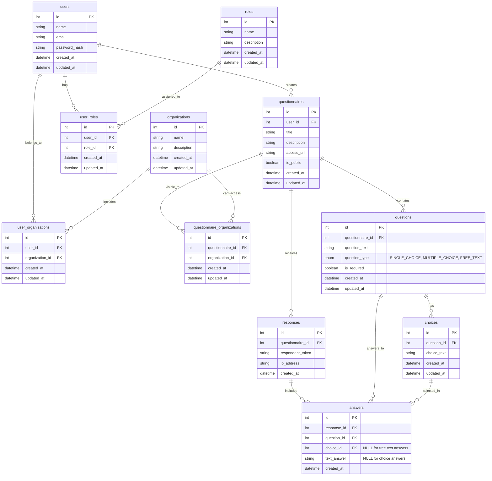

```mermaid
---
title: ""
---
erDiagram
    users {
        int id PK
        string name
        string email
        string password_hash
        datetime created_at
        datetime updated_at
    }

    organizations {
        int id PK
        string name
        string description
        datetime created_at
        datetime updated_at
    }

    user_organizations {
        int id PK
        int user_id FK
        int organization_id FK
        datetime created_at
        datetime updated_at
    }

    roles {
        int id PK
        string name
        string description
        datetime created_at
        datetime updated_at
    }

    user_roles {
        int id PK
        int user_id FK
        int role_id FK
        datetime created_at
        datetime updated_at
    }

    questionnaires {
        int id PK
        int user_id FK
        string title
        string description
        string access_url
        boolean is_public
        datetime created_at
        datetime updated_at
    }

    questionnaire_organizations {
        int id PK
        int questionnaire_id FK
        int organization_id FK
        datetime created_at
        datetime updated_at
    }

    questions {
        int id PK
        int questionnaire_id FK
        string question_text
        enum question_type "SINGLE_CHOICE, MULTIPLE_CHOICE, FREE_TEXT"
        boolean is_required
        datetime created_at
        datetime updated_at
    }

    choices {
        int id PK
        int question_id FK
        string choice_text
        datetime created_at
        datetime updated_at
    }

    responses {
        int id PK
        int questionnaire_id FK
        string respondent_token
        string ip_address
        datetime created_at
    }

    answers {
        int id PK
        int response_id FK
        int question_id FK
        int choice_id FK "NULL for free text answers"
        string text_answer "NULL for choice answers"
        datetime created_at
    }

    users ||--o{ questionnaires : "creates"
    users ||--o{ user_organizations : "belongs_to"
    users ||--o{ user_roles : "has"
    organizations ||--o{ user_organizations : "includes"
    roles ||--o{ user_roles : "assigned_to"
    questionnaires ||--o{ questionnaire_organizations : "visible_to"
    organizations ||--o{ questionnaire_organizations : "can_access"
    questionnaires ||--o{ questions : "contains"
    questions ||--o{ choices : "has"
    questionnaires ||--o{ responses : "receives"
    responses ||--o{ answers : "includes"
    questions ||--o{ answers : "answers_to"
    choices ||--o{ answers : "selected_in"
```
