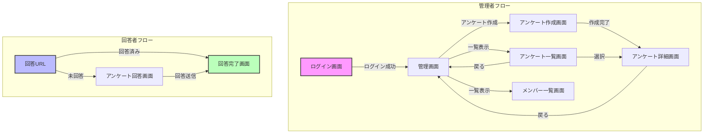

```

この図は以下の画面遷移を表現しています：

1. 管理者フロー
   - ログイン画面から管理画面へ
   - 管理画面からアンケート作成・一覧表示
   - アンケート詳細での URL 管理

2. 回答者フロー
   - 回答 URL からアンケート回答画面へ
   - 回答完了後の集計結果表示

色分けの意味：
- ピンク: エントリーポイント（ログイン）
- 青: 外部アクセスポイント（回答 URL）
- 緑: 完了画面
```
